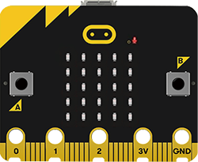
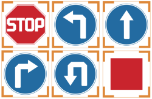
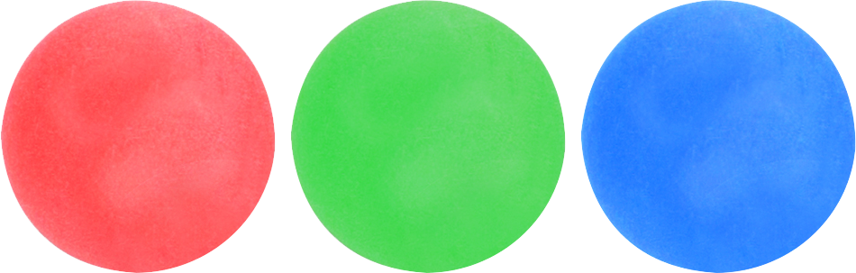
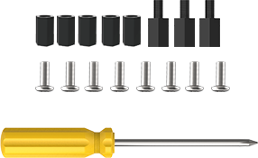

# 1. Getting Ready

## 1.1 AiHand Introduction

**1.1.1 Product Introduction**

AiHand is a programmable robotic hand powered by micro:bit. With 6 joints and the micro:bit V2 as its core controller, it incorporates a variety of sensor modules, making it an excellent tool for learning programming and electronics.

The robotic hand features five built-in anti-blocking servos that protect the robot during operation and significantly extend its lifespan. It also comes with a 180-degree pan-tilt, enhancing its flexibility.

Additionally, it expands its capabilities with multiple onboard sensors and electronic modules, including an ultrasonic sensor and a WonderCam vision module. This enables more interesting and creative games.

## 1.2 Packing List

- **AiHand Robotic Hand**

|        **Accessory**         |                                    **Picture**                                     | **Quantity** |
| :--------------------------: |:----------------------------------------------------------------------------------:| :----------: |
|            AiHand            |   |      1       |
|     micro:bit (optional)     |   |      1       |
|        USB data cable        |   |      1       |
| 7.4V 3A power adapter (DC35) |   |      1       |
|  Glowing ultrasonic sensor   |   |      1       |
|         Waste cards          |   |      1       |
|         Number cards         |                       |      1       |
|        Traffic signs         |   |      1       |
|             Tags             |  |      1       |
| Red+green+blue balls (40mm)  |  |      1       |
| 4PIN sensor wire (200mm) |  |              |
|        Accessory bag         |  |      1       |

## 1.3 Install & Power Instruction

**1.3.1 Install Baseboard Nylon Pillar**

The installation method is as below:

* **Required accessory**

|    |     |
|:-----------------------------------------------------------------------------------------------------------------------------------------------------------------------------------------------------------------------------------------------------------------------------------------------------------------------:|:---------------------------------------------------------------------------------------------------------------------------------------------------------------------------------------------------------------------------------------------------------------------------:|
|                                                                                                                                          **M4\*6 Double-pass nylon pillar x4**                                                                                                                                          |                                                                                                                             **M4\*6 Screw x4**                                                                                                                              |

* **Installation method**

**1.3.2 Install Ultrasonic Sensor**

The installation method is as below:

* **Required accessory**

|  |   |   |   |
| :----------------------------------------------------------: | :----------------------------------------------------------: | :----------------------------------------------------------: | :----------------------------------------------------------: |
|                   **Ultrasonic sensor x1**                   |           **M4\*6+6 Single-pass nylon pillar x2**            |                        **M4 Nut x2**                         |                      **M4\*6 Screw x2**                      |

* **Installation method**

**1.3.3 Power Supply Instruction**

AiHand is powered by a 7.5V 3A power adapter as shown below:

