# 5. AiHand Basic Games Lesson

## 5.1 Button Control

### 5.1.1 Project Introduction

Turn on the AiHand. When the button A on the micro:bit board is pressed, the robotic hand closes; when the button B is pressed, it opens. If the logo is pressed, it returns to its initial position, which a half-clenched gesture.

### 5.1.2 Project Flowchart

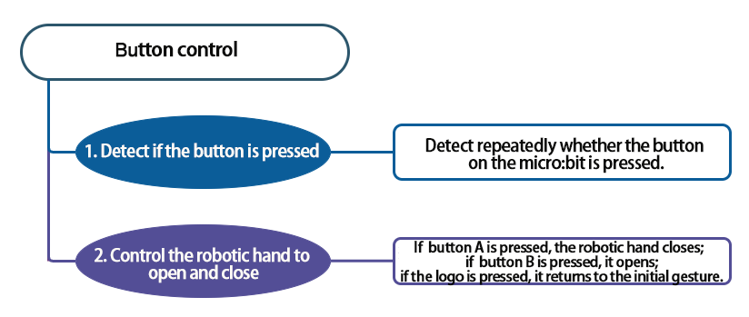

### 5.1.3 Module Introduction

In this section, let’s use the buttons A, B, and logo on the micro:bit board to control the robotic hand.

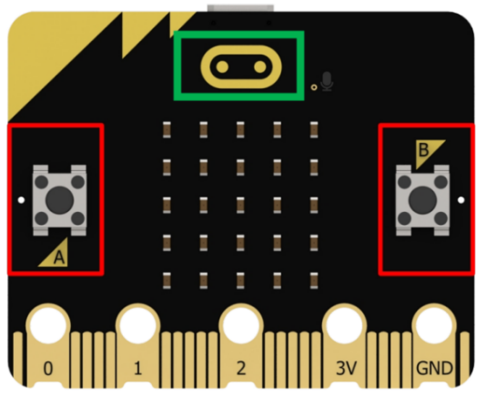

### 5.1.4 Program Analysis

(1) When AiHand is turned on, initialize the configuration of the micro:bit board. Call the “**Initialize**” function to control the robotic hand to enter its initial state.

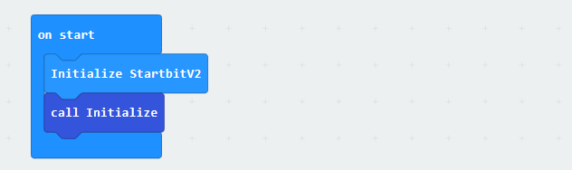

In the “**Initialize**” function, set the angles of the 6 servos to 90° and the running time to 500ms. The robotic hand will be in a half-clenched fist gesture. Servos 1 to 5 correspond to the thumb to pinky finger on the robotic hand. Servo 6 corresponds to the pan-tilt.

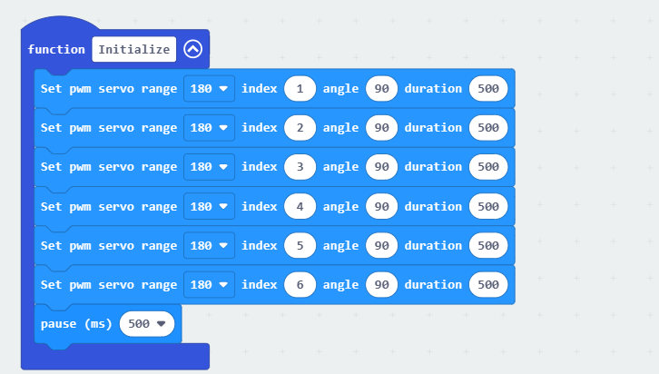

(2) When button A on the micro:bit is pressed, set servo 1 to an angle of 130° and servos 2 to 5 to an angle of 50°. The robotic hand will make a fist.

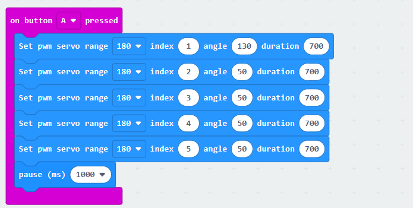

When the servo’s angle is 90°, it is in the neutral position. When the angles of servos 1 to 5 are all 90°, the robotic is in a half-clenched fist gesture. Since the installation direction of servo 1 is opposite to that of servos 2 to 5, their rotation angles are also opposite.

(3) When button B is pressed, set the angle of servo 1 to 50° and the angles of servos 2 to 5 to 130°. The robotic hand will open.

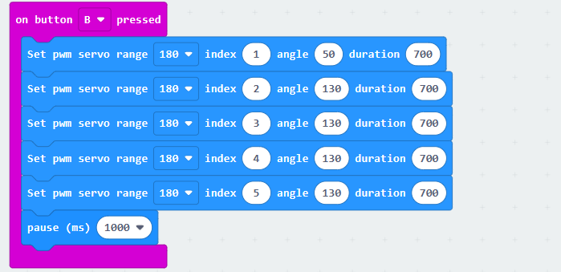

(4) When the logo is pressed, call the “**Initialize**” function to return the robotic hand to its initial position.

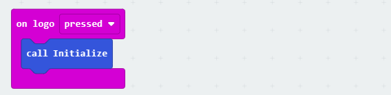

### 5.1.5 Program Download

[Button Control Program.hex]()

(1) Click in the lower left corner of the interface, and select **“Connect Device”**. Follow the pop-up prompt to connect the micro:bit.

(2) Click **“Download”** in the lower left corner to flash the program.

(3) After the download is completed, the indicator will stop blinking and keep lighting up. The programming interface will prompt **“Downloaded”.**

### 5.1.6 Program Outcome

Once the program is downloaded, turn on the AiHand. The robotic hand will enter its initial state, which is a half-clenched gesture. When button A is pressed, the robotic hand will close. When button B is pressed, it will open. When the logo is pressed, it will return to its initial position.

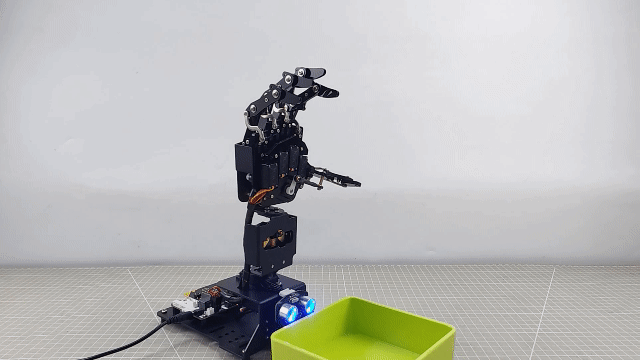

## 5.2 Ultrasonic Ranging

### 5.2.1 Project Introduction

This program utilizes the ultrasonic sensor on the AiHand to measure the distance. Then, it controls the opening and closing of the robotic hand based on the measurement result.

### 5.2.2 Project Flowchart

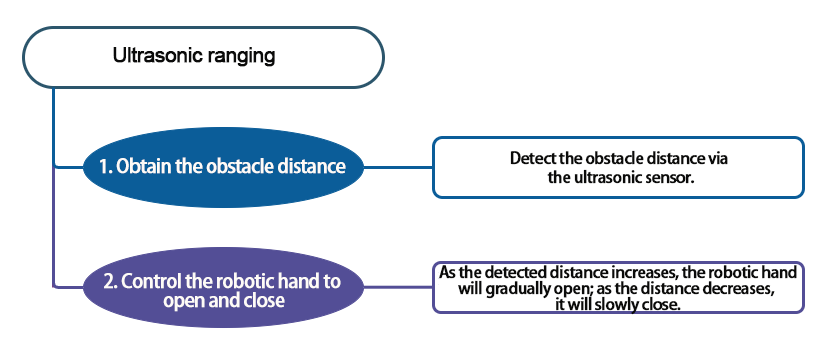

### 5.2.3 Module Introduction

This is a glowing ultrasonic ranging module. It adopts an I2C communication interface, which can read the range measured by an ultrasonic sensor through I2C communication.

The module integrates two RGB lights at the probes. They not only allow for adjustment of the light brightness, but also enable colorful color changes through changes in the red (R), green (G), and blue (B) color channels and their combination.

The ultrasonic sensor will automatically transmit 8 square waves at 40khz during ranging, and then detect whether there is a signal return. If there is a signal return, it outputs a high voltage level, whose continuing time is the time of the ultrasonic from transmitting to returning.

Formula: measurement distance=(high voltage level time\*sound speed (340m/s))/2.

### 5.2.4 Program Analysis

(1) When AiHand is turned on, initialize the micro:bit board. Set the angles of the 6 servos to 90°. The robotic hand will be in a half-clenched gesture. Set the **“distance”** and **“angle”** variables to 0, and the running time to 500ms. Servos 1 to 5 correspond to the thumb to pinky finger of the robotic hand. Servo 6 corresponds to the pan-tilt.

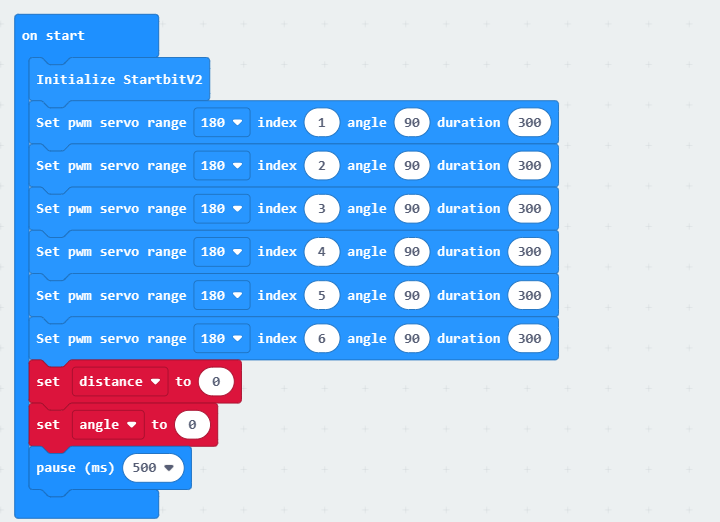

The **“distance”** represents the distance value detected by the ultrasonic sensor. The **“angle”** controls the rotation angle of the servo.

(2) Divide the distance value obtained from the ultrasonic sensor by 10, converting the unit to cm. Store it in the “distance” variable. Then, limit the value of the variable within the range of 5 to 25, rounding the data to the nearest integer.

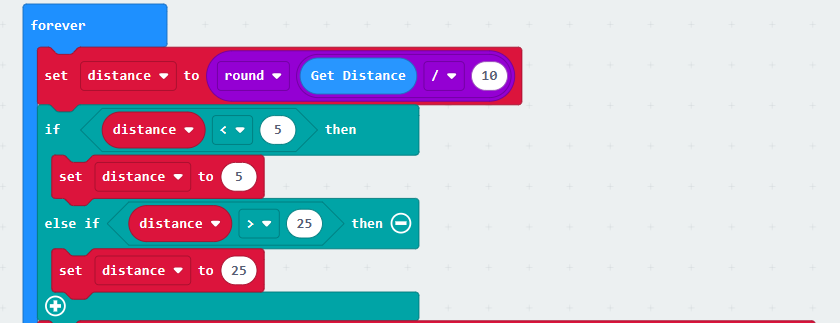

(3) Map the **“distance”** variable value from the range of 5 to 25 to the range of 50 to 130 for the servo’s rotation angle. Assign the integer value to the “angle” variable.

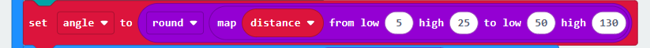

Mapping means enlarging the distance detected by the ultrasonic sensor from the range of 5 to 25 to the range of 50 to 130 for the servo’s rotation angle. For example, when the value **“15”** is in the middle of the range of 5 to 25, mapping it to the middle of the range of 50 to 130, the servo angle will be **“90”.**

(4) Set the mapped angle to the servo angle. For servo 1, take **“180-angle”;** for the other servos, take the **“angle”.** It makes all five fingers of the robotic hand extend or bend simultaneously .

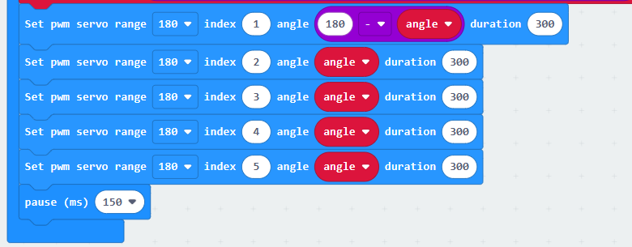

The installation direction of servo 1 is opposite to that of servos 2 to 5. Therefore, their rotation angles are also opposite. When the value of servo 1 is **“180-angle”**, the value of servos 2 to 5 is **“angle”.**

### 5.2.5 Program Download

[Ultrasonic Ranging Program.hex]()

(1) Click in the lower left corner of the interface, and select **“Connect Device”.** Follow the pop-up prompt to connect the micro:bit.

(2) Click **“Download”** in the lower left corner to flash the program.

(3) After the download is completed, the indicator will stop blinking and keep lighting up. The programming interface will prompt **“Downloaded”.**

### 5.2.6 Program Outcome

After downloading the program, turn on the AiHand. Place an obstacle with flat surface in front of the ultrasonic module. As the obstacle approaches the ultrasonic module, the robotic hand will gradually close. As the obstacle moves away from the ultrasonic module, the robotic hand will slowly open. The specific game effect is as follows:

<table  class="docutils-nobg" style="margin:0 auto" border="1">
<colgroup>
<col  />
<col  />
</colgroup>
<tbody>
<tr>
<td >
Distance S

between the obstacle and the ultrasonic sensor
</td>
<td >Corresponding gesture</td>
</tr>
<tr>
<td >Distance S ≤ 5 cm</td>
<td >The robotic hand makes a fist.</td>
</tr>
<tr>
<td >5cm ＜ Distance S ＜ 25 cm</td>
<td >
As the obstacle approaches, the robotic hand gradually closes. The closer the obstacle, the more it closes.

As the obstacle moves away, the robotic hand slowly opens. The farther the obstacle, the more it opens.
</td>
</tr>
<tr>
<td >Distance S ≥ 25 cm</td>
<td >The robotic hand opens.</td>
</tr>
</tbody>
</table>

## 5.3 Ultrasonic Gripping

### 5.3.1 Project Introduction

This game uses the ultrasonic module on AiHand to measure the distance. When the distance between the ultrasonic sensor and the obstacle is less than 10cm, the robotic hand will close to grip the ball. When the distance is detected to be less than 10cm again, it will open to release the ball.

### 5.3.2 Project Flowchart

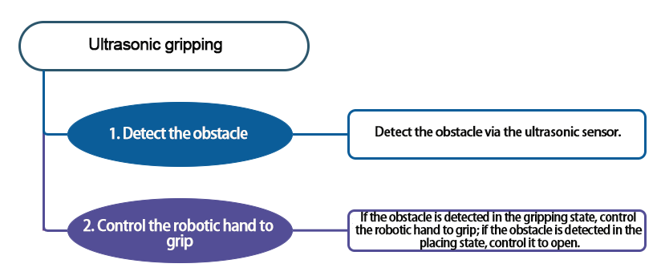

### 5.3.3 Module Introduction

This is a glowing ultrasonic ranging module. It adopts an I2C communication interface, which can read the range measured by an ultrasonic sensor through I2C communication.

The module integrates two RGB lights at the probes. They not only allow for adjustment of the light brightness, but also enable colorful color changes through changes in the red (R), green (G), and blue (B) color channels and their combination.

The ultrasonic sensor will automatically transmit 8 square waves at 40khz during ranging, and then detect whether there is a signal return. If there is a signal return, it outputs a high voltage level, whose continuing time is the time of the ultrasonic from transmitting to returning.

### 5.3.4 Program Analysis

When the AiHand is turned on, initialize the micro:bit and the RGB LED. Set the brightness of the RGB LED to 255. The angles of the 6 servos are set to 90°. The robotic hand will be in its initial position. Servos 1 to 5 correspond to the thumb to pinky finger of the robotic hand. Servo 6 corresponds to the pan-tilt. Set the “state” variable to 1, indicating that it is in the state of waiting to grab.

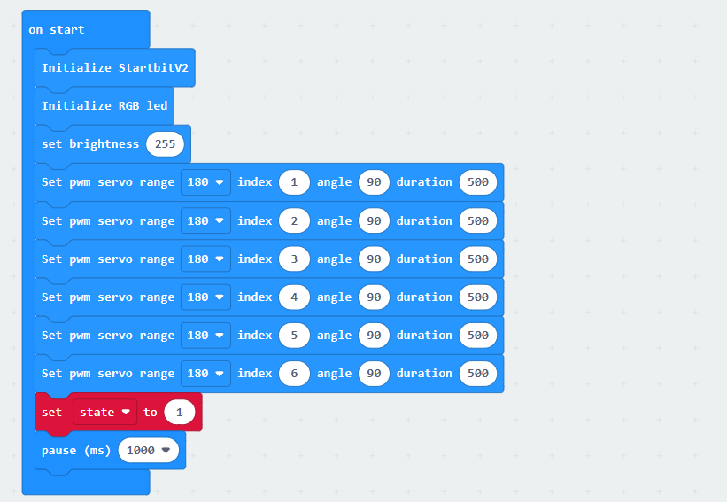

(1) In the **“forever”** loop, control the robotic hand to perform different actions based on the “**state**” variable. Start from the status 1.

If the distance value returned by the ultrasonic sensor is less than 100mm, set the two RGB LEDs of the ultrasonic sensor to red. The three channels correspond to red, green, and blue. The larger the value, the brighter the color. Set the RGB LED on the expansion board to red. After displaying the light, delay for 1000ms. This allows you to place the object in front of the robotic hand.

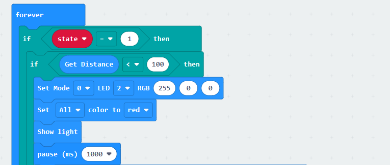

Set the angle of servo 1 to 130 degrees and servos 2 to 5 to 50 degrees, enabling the robotic hand to grip the ball. After grabbing, set the “**state**” variable to 2 to switch to the state of releasing. After a delay of 1000ms, the RGB LEDs of the ultrasonic sensor is set to blue. The RGB LED on the expansion board is turned off simultaneously.

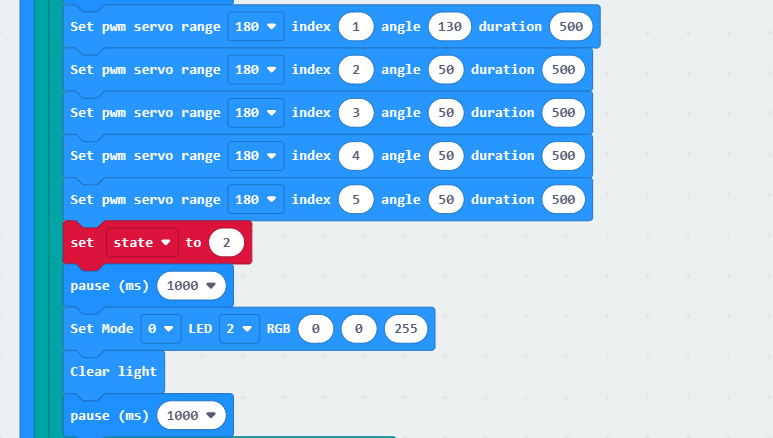

(2) When the “**state**” variable is 2, if the distance value returned by the ultrasonic sensor is less than 100mm, the RGB LEDs on the ultrasonic sensor and the expansion board will be set to green. After displaying the lights, delay for 1000ms.

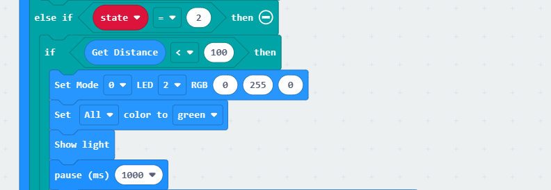

Set the angle of servo 1 to 50 degrees and servos 2 to 5 to 130 degrees, allowing the robotic hand to open. Then set the “**state**” variable to 1 to switch to the state of waiting to grab. Next, set the color of the RGB LEDs of the ultrasonic sensor to blue. The RGB LED the expansion board is turned off simultaneously.

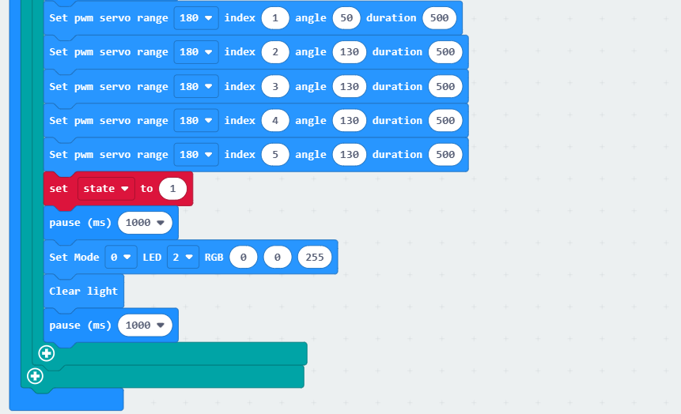

### 5.3.5 Program Download

[Ultrasonic Griping Program.hex]()

(1) Click in the lower left corner of the interface, and select **“Connect Device”**. Follow the pop-up prompt to connect the micro:bit.

(2) Click **“Download”** in the lower left corner to flash the program.

(3) After the download is completed, the indicator will stop blinking and keep lighting up. The programming interface will prompt **“Downloaded”**.

### 5.3.6 Program Outcome

After downloading the program, turn on the AiHand. The robotic hand is in its initial position. When the distance between the ultrasonic sensor and the ball is less than 10cm, the RGB LED on the expansion board will turn red. You can simultaneously place the ball in front of the robotic hand. The robotic hand will grip the ball.

When the distance is detected to be less than 10cm again, the RGB LEDs on the ultrasonic sensor and the expansion board will turn green. The robotic hand will simultaneously open to release the ball.

## 5.4 Finger Counting

### 5.4.1 Project Introduction

After the AiHand is turned on, it is in a closed state by default. When a sound exceeding the set threshold is detected for the first time, its thumb will be opened. When another sound is detected, its index finger will be opened. Repeat this process until all five fingers are opened. Next, if a sound exceeding the set threshold is detected again, the robotic hand will be closed. A new round of detection will begin.

### 5.4.2 Project Flowchart

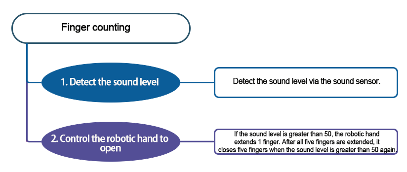

### 5.4.3 Module Introduction

In this lesson, the sound sensor on the micro:bit board will be used. Its position on the micro:bit is shown below:

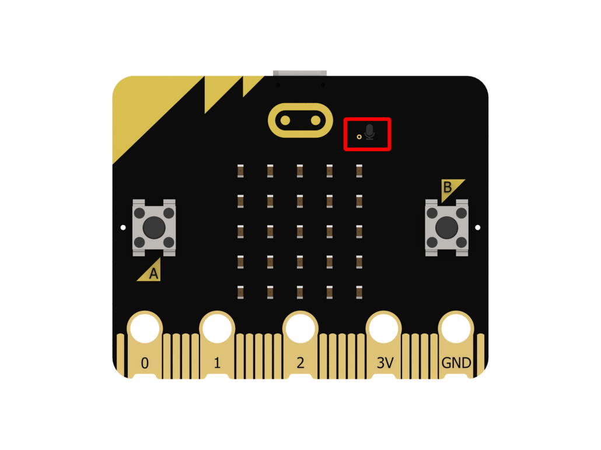

### 5.4.4 Program Analysis

(1) After the AiHand is turned on, initialize the micro:bit board. Call the **“Initialize”** function to put the robotic hand in its initial gesture.

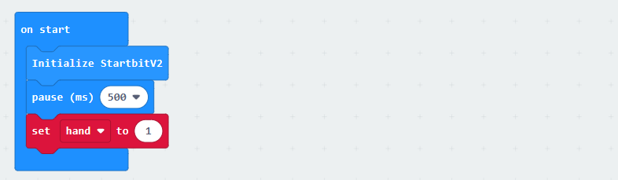

Set the rotation angle of servo 1 to 130°, and that of servos 2 to 5 to 50°. Servos 1 to 5 correspond to the thumb to little finger of the robotic hand. Servo 6 corresponds to the pan-tilt. Set the variable “hand” to 1, indicating the number of fingers to be extended.

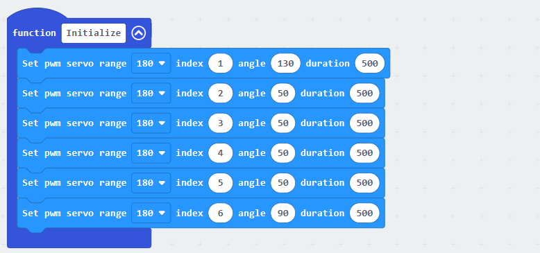

(2) Through the **“forever”** loop, continuously detect the sound level of the environment. When the sound level is greater than 100, determine the value of the “hand” variable. If it is “1”, control the angle of servo 1 to 50°, which extends the thumb. Then, increase the value of the “hand” variable by 1.

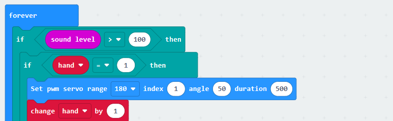

(3) When the “hand” variable is less than or equal to 5, control the servo whose value is the same as the “hand” variable to rotate to 140°, which extends the fingers in order.

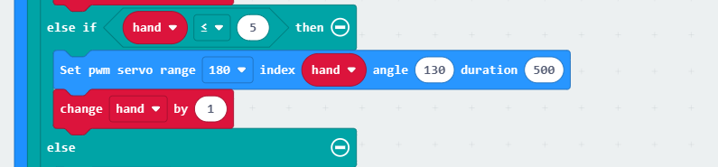

(4) If the value of the “hand” variable is greater than 5, call the **“Initialize”** function to make the robotic hand return to its initial gesture. Set the “hand” variable to 1. When a sound is detected again, the rotation will start from the thumb servo.

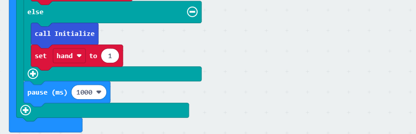

### 5.4.5 Program Download

[Finger Counting Program.hex]()

(1) Click in the lower left corner of the interface, and select **“Connect Device”**. Follow the pop-up prompt to connect the micro:bit.

(2) Click **“Download”** in the lower left corner to flash the program.

(3) After the download is completed, the indicator will stop blinking and keep lighting up. The programming interface will prompt **“Downloaded”.**

### 5.4.7 Program Outcome

When a sound exceeding the set threshold is detected for the first time, the thumb will be opened. When another sound is detected, the index finger will be opened. Repeat this process until all five fingers are opened. Next, if a sound exceeding the set threshold is detected again, the robotic hand will be closed. A new round of detection will begin.

## 5.5 Intelligent Voice Control

### 5.5.1 Project Introduction

This program uses the ultrasonic sensor to detect the distance between the obstacle and the AiHand. If the distance is less than 10cm, the robotic hand will grab the ball. After grabbing the ball, if the sound sensor detects a sound, the robotic hand will open to release the ball.

### 5.5.2 Project Flowchart

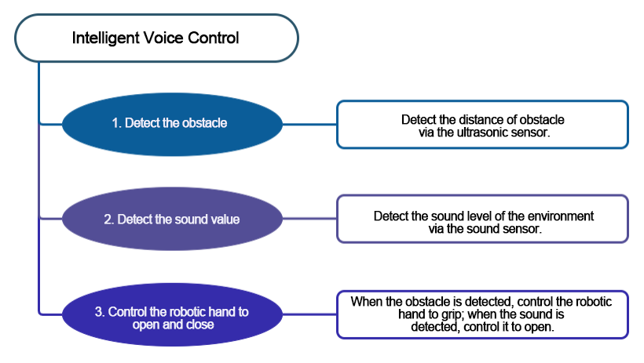

### 5.5.3 Module Introduction

In this lesson, the sound sensor on the micro:bit board will be used. Its position on the micro:bit is shown below:

### 5.5.4 Program Analysis

(1) When the device is turned on, initialize the micro:bit. Set the angles of the 6 servos to 90°. Servos 1 to 5 correspond to the thumb to little finger of the robotic hand. Servo 6 corresponds to the pan-tilt. Set the “**state**” variable to 1, indicating the waiting-to-grab state. After the initialization is completed, display the “heart” icon.

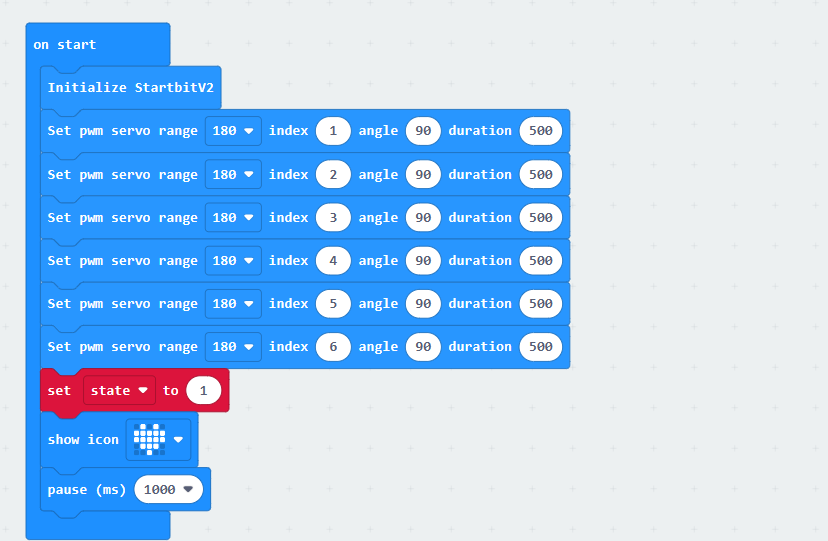

(2) When the state is 1, if the ultrasonic module detects an obstacle distance less than 100mm, display the diamond pattern. After a delay of 1000ms, control the robotic hand to close. Set servo 1 to 130° and servos 2 to 5 to 50°. Then, set the “state” variable to 2.

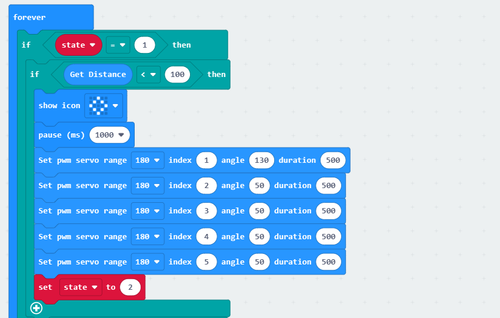

(3) When the **“state”** variable is 2, it indicates the waiting-to-place stage. Detect the sound level via the sound sensor on the micro:bit. When the sound intensity is greater than or equal to 100, display the music icon. Then, control the robotic hand to open. Next, set the “state” variable to 1, switch to the waiting-to-grab stage, and display the **“heart”** icon.

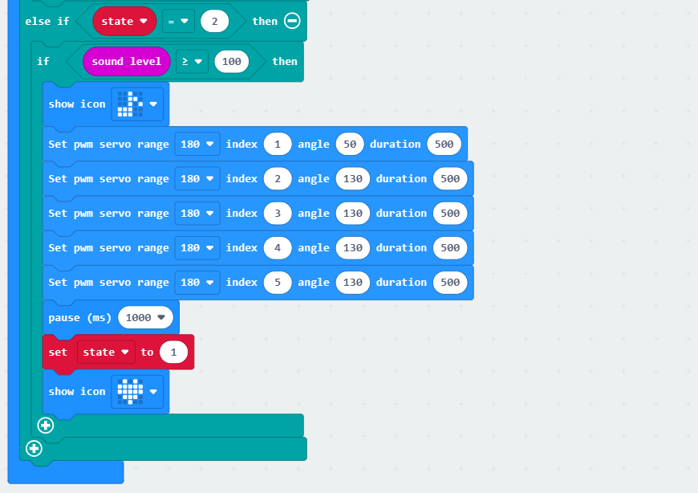

### 5.5.5 Program Download

[Intelligent Voice Control Program.hex]()

(1) Click in the lower left corner of the interface, and select **“Connect Device”.** Follow the pop-up prompt to connect the micro:bit.

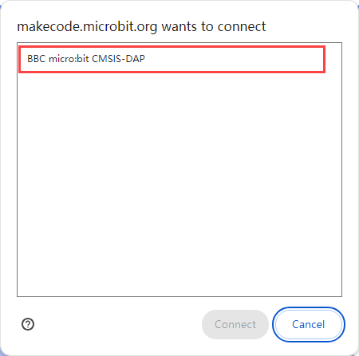

(2) Click **“Download”** in the lower left corner to flash the program.

(3) After the download is completed, the indicator will stop blinking and keep lighting up. The programming interface will prompt **“Downloaded”.**

### 5.5.6 Program Outcome

After downloading the program, turn on the AiHand. The robotic hand is in the opening status. Place the ball in front of the ultrasonic sensor with the distance less than 10cm. Then, when you place the ball in the front of the robotic hand, it will grip the ball.

After the robotic hand grips the ball, clap your hands to create a sound. When the sound intensity exceeds a threshold of 35, the robotic hand will open to release the ball.

## 5.6 APP Control

### 5.6.1 Project Introduction

The AiHand can be controlled for individual finger movement and overall motion through the app.

### 5.6.2 Project Flowchart

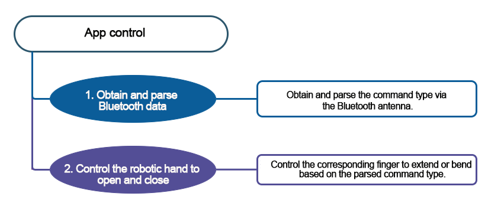

### 5.6.3 Module Introduction

The Bluetooth antenna on the micro:bit is located as shown in the following diagram:

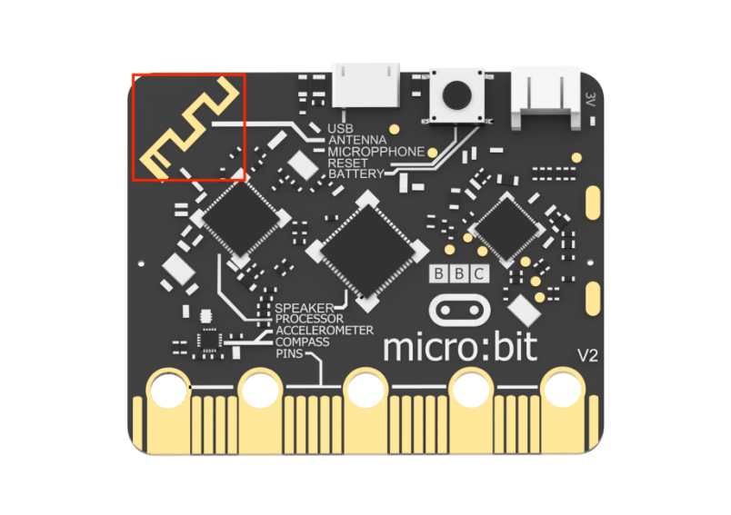

### 5.6.4 Program Analysis

(1) When the AiHand is turned on, initialize the micro:bit board. Set the angles of the 6 servos to 90 degrees. Servos 1 to 5 correspond to the thumb to little finger of the robotic hand. Servo 6 corresponds to the pan-tilt.

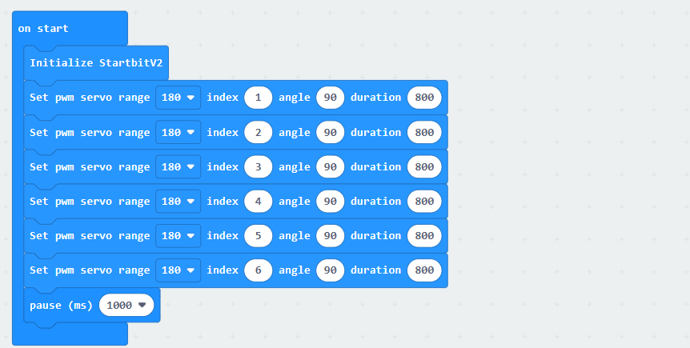

(2) Define variables **“Bluetooth command character”** and **“command type”** to store the signal received from the Bluetooth module and parse the Bluetooth command characters sent by the app respectively. If the received Bluetooth command character matches the command type in the firmware, the robotic hand will perform the set action.

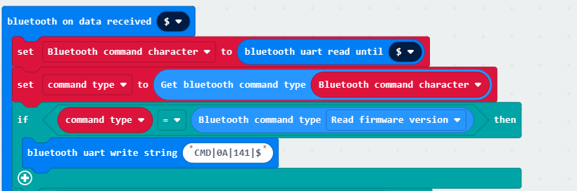

(3) If the robotic hand receives a servo control command via Bluetooth, set three variables to store the three parameters of the servo control command: “**servo number**”, “**servo angle**”, and “**servo runtime**”.

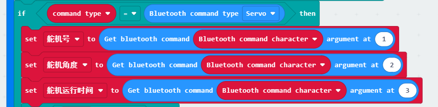

If the servo number parsed is 1, set the servo number to 6. The data packet transmitted by the slider at the bottom left of the app interface has a servo number of 1. However, it should actually control servo 6. Modify the servo number to 6. Set the servo angle to **“180-angle”** to make the rotation direction of the robotic hand consistent with that of the slider.

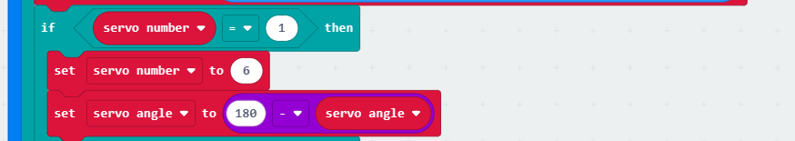

If the servo number is not 1, subtract 1 from the servo number. This is because the data packet transmitted by the robotic hand control button on the left side of the app interface has servo numbers of 2 to 6. However, the actual servos to be controlled are 1 to 5. Next, control the servo rotation based on the servo number, servo angle, and servo runtime.

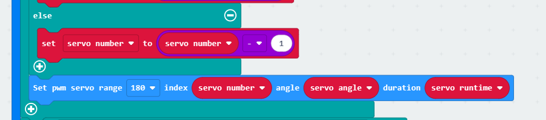

(4) If the robotic hand receives a motion control command via Bluetooth, get parameter 1 from the Bluetooth command character as the motion number.

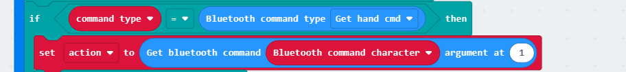

If the motion number is 1, send the string **“CMD\|15\|01\|\$”** to the app via Bluetooth. Then, control servos 1 to 5 to rotate, enabling the index finger to extend. Servo 1 is the thumb servo, which is installed in a different position from the other servos and rotates in the opposite direction. Therefore, with 90 degrees as the neutral position, the angle of servo 1 is 130 degrees when the thumb is bent. Servos 2 to 5 rotate to 50 degrees to bend the fingers. They are in the same rotation angle but the opposite direction.

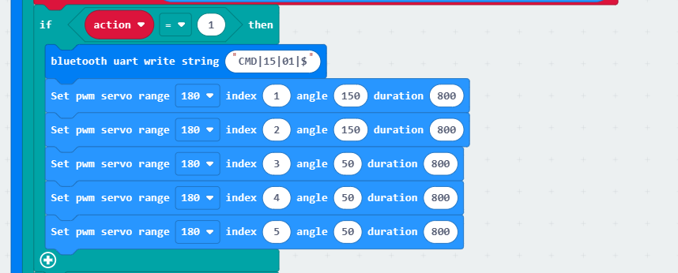

The implementation of robotic hand control programs for motions 2 to 7 is similar to that of motion 1.

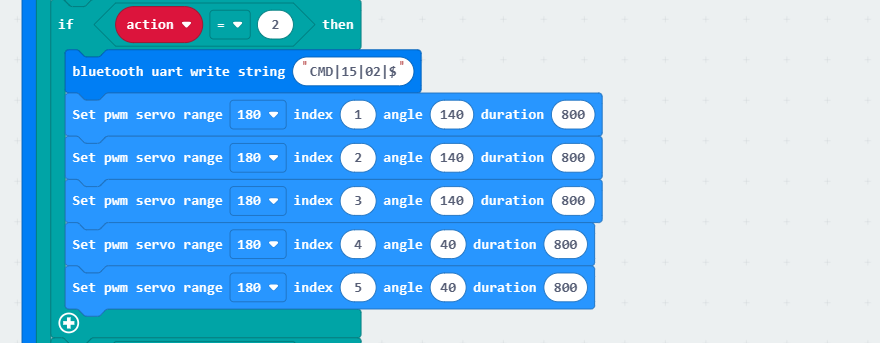

Here are the motion numbers and the corresponding hand gestures.

| Motion Number | Hand Gesture     | Motion Number | Hand Gesture     |
| ------------- | ---------------- | ------------- | ---------------- |
| 1             | Extend 1 finger  | 2             | Extend 2 fingers |
| 3             | Extend 3 fingers | 4             | Extend 4 fingers |
| 5             | Extend 5 fingers | 6             | Initial gesture  |
| 7             | Make a fist      |               |                  |

### 5.6.5 Program Download

[APP Control Program.hex]()

(1) Click in the lower left corner of the interface, and select **“Connect Device”**. Follow the pop-up prompt to connect the micro:bit.

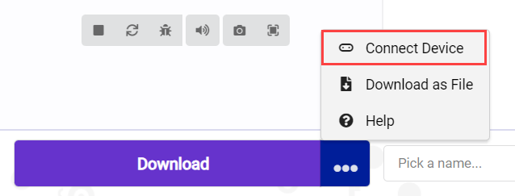

(2) Click **“Download”** in the lower left corner to flash the program.

(3) After the download is completed, the indicator will stop blinking and keep lighting up. The programming interface will prompt **“Downloaded”.**

### 5.6.6 Program Outcome

The servo control area on the left side of the app interface can control the opening and closing of a single finger. The right side of the app interface can control the robotic hand to make a gesture.