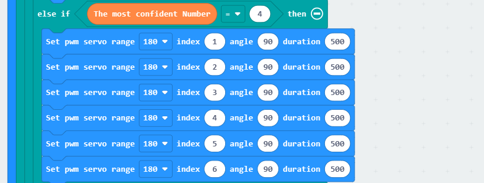
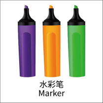
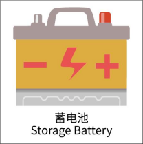
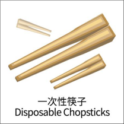
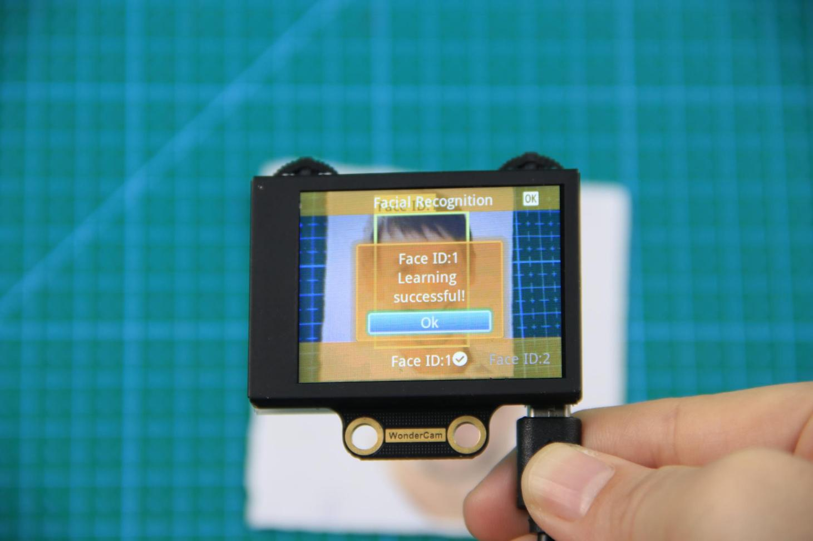
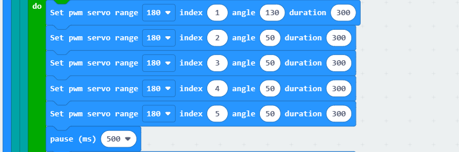

# 6. AI Vision Games Lesson

## 6.1 WonderCam AI Vision Module Introduction

### 6.1.1 Introducing WonderCam

* **Instructions**

WonderCam is an user-friendly AI visual module with eight built-in functions: Color Recognition, Facial Recognition, AprilTag Recognition, Visual Line Following, Numeric Recognition, Landmark Recognition, Image Classification and Feature Learning.

WonderCam make learning AI fun and easy to comprehend. With 1-Click Training feature, it can readily program many creative AI visual projects.

WonderCam IIC connector works seamlessly with many global leading controllers like micro:bit, Arduino, Raspberry Pi etc. By sending the recognized result output to the controller, you can focus on project creativity without the programming complexity.

* **Operation Overview**

**IIC Connectors Specification**

<table  class="docutils-nobg" border="1">
  <thead>
    <tr>
      <th align="center" width="33%">S/N</th>
      <th align="center"  width="33%">Name</th>
      <th align="center" width="33%">Function</th>
    </tr>
  </thead>
  <tbody>
    <tr>
      <td align="center">1</td>
      <td align="center">SCL</td>
      <td align="center">IIC Serial Clock Pin</td>
    </tr>
    <tr>
      <td align="center">2</td>
      <td align="center">SDA</td>
      <td align="center">IIC Serial Data Pin</td>
    </tr>
    <tr>
      <td align="center">3</td>
      <td align="center">GND</td>
      <td align="center">IIC Negative Pin</td>
    </tr>
    <tr>
      <td align="center">4</td>
      <td align="center">5V</td>
      <td align="center">5V Positive Pin</td>
    </tr>
  </tbody>
</table>

* **User Learning Guideline**

Step 1: Understanding WonderCam module and operating familiarization

Start with [6.1.1 Introducing WonderCam](#anchor_6_1) follow by [6.1.2 Getting Started](#anchor_6_1_2).

Step 2: Step by Step guide to AI Visual Module features and functions

The 8 lessons are: Color Recognition, Facial Recognition, AprilTag Recognition, Visual Line Following, Numeric Recognition, Road Sign Recognition, Image Classification and Feature Learning.

Step 3: Learn as needed

Upon experiencing all the features and functions, learner can further explore programming each features with the guideline provided for different platform.

### 6.1.2 Getting Started

:::{Note}

WonderCam comes preinstalled with firmware and is ready to use.

:::

* **Start**

Power Supply method:

(1) Using USB cable to connect to computer USB port or to USB charger.

(2) Using 4Pin connector to connect to Controller Expansion Board e.g. Hiwonder micro:bit expansion Board, Arduino Expansion Board.

Important Note on Power Supply:

a. Do not exceed 5V in power supply. Use only charger or battery power not more than 5V.

b. Ensure consistent voltage supply or WonderCam will perform erratically.

* **Operating Guide**

(1) Basic Operation

When start up, default display and function will be on Color Recognition.

Located on top left and right of WonderCam are two function buttons. Switch

between menu or functions by pushing the button left or right, press button

downward to execute selection.

The top left function button is menu navigation, top right function button is to select the menu functions.

In following example, move to Facial Recognition function.

a. Navigation Button: Move Navigation Left/ Right to switch menu.

When navigating and switching menu, wait for Progress Circle to disappear to

complete the command.

b. Function Button:Settings for each menu selected.

Please note: the function setting icons will change according to menu selected.

Push Function Button to the Right direction to switch Fill Light to On/Off.

(2) Function Settings

Certain function settings is configurable. Example,Face Recognition can configure Detection Threshold level, NMS Threshold etc. The functions can be configured when a Gear icon display on top right screen.

Step 1: Configuration settings

In Face Recognition menu, Press Function Button downward to select Gear icon function to access threshold configuration interface.

Step 2: Settings

Push button left/right to see the types of threshold to configure.

Press function button down again to select the threshold type.

Push button left/right to adjust selected threshold level.

When done, press function button downward to select OK. Interface will return to previous menu.

Step 3: Exit setting, back to main menu

Press Navigation button downward on \<x\> icon to exit. Move Navigation button left or right direction to toggle between "**Yes**" or "**No**" to save new settings. Press Function button downward to select.

(3) System Settings

Apart from individual function settings, WonderCam device setting is configurable as well.

Step 1: Enter System Setting

On main menu, move Navigation button to Right direction until last option

**"System Settings"**. Press Function button downward on Gear icon to enter

system settings mode.

Step 2: Settings

(1) Display Brightness - to adjust display brightness.

(2) Fill Light Brightness - to adjust fill light brightness.

(3) Hide Menu Timeout - to set timeout on display of menu.

If set at 30, after 30 seconds idle from operation, the menu will be hidden.

(1) I2C Address - to set WonderCam I2C communication protocol address.

(2) Default setting is 0x32.

(3) Language - to set system language.

Current version supports English and Simplified Chinese.Upon setting confirmation, WonderCam will restart for new setting to take effect.

* **Understanding Coordinate**

Understanding the coordinate system will benefits the comprehension of how WonderCam process data output which will be mention in the later lessons.

See image below on the assigned on x and y axis.

## 6.2 Landmark Recognition Function Introduction

### 6.2.1 Instructions

Distance from Card to WonderCam camera should be between 15cm to 20cm.

Ensure sufficient lighting in the surrounding and use white background for better recognition results.

### 6.2.2 Introduction to Number Recognition Function

Using the programmed Landmark recognition model to recognize the picture and present the corresponding ID number on display.

:::{Note}

Use the number template provided.

:::

### 6.2.3 Number Recognition Operations

* **Enter Function**

Push Navigation button to Landmark Recognition menu.

* **Recognizing Landmark**

When in Landmark Recognition mode and using the templates provided,WonderCam is able to recognized the mark and present the corresponding ID

number on its display. When in operation, a value will also be shown to signify the trust value. The highest value is 1.0 being closest matched.

Distance from Card to WonderCam camera should be between 15cm to 20cm. Ensure sufficient lighting in the surrounding and use white background for better recognition results.

<table  class="docutils-nobg" border="1">
  <colgroup>
    <col  />
    <col  />
    <col  />
    <col  />
  </colgroup>
  <thead>
    <tr>
      <th><strong>Card</strong></th>
      <th><strong>ID</strong></th>
      <th><strong>Card</strong></th>
      <th><strong>ID</strong></th>
    </tr>
  </thead>
  <tbody>
    <tr>
      <td></td>
      <td>1</td>
      <td></td>
      <td>2</td>
    </tr>
    <tr>
      <td></td>
      <td>3</td>
      <td></td>
      <td>4</td>
    </tr>
    <tr>
      <td></td>
      <td>5</td>
      <td></td>
      <td></td>
    </tr>
  </tbody>
</table>

## 6.3 Landmark Recognition

### 6.3.1 Project Introduction

Program the AiHand to recognize traffic signs via the WonderCam vision module. The robotic hand executes corresponding feedback actions based on the recognized traffic signs, such as **"extending index finger"**, **"rotating to the left",** **"rotating to the right",** **"rotating left and right"**, and **"returning to the initial position"**.

### 6.3.2 Program Flowchart

### 6.3.3 Module Introduction

In this section, the WonderCam vision module is used for recognizing traffic signs. For more details, please refer to instructions in the [6.1 WonderCam Introduction](#anchor_6_1).

### 6.3.4 Program Analysis

(1) When AiHand is turned on, initialize the `micro:bit` and the `WonderCam` vision module. Switch the function of the vision module to landmark recognition. Set the angle of 6 servos to 90°. Servos 1 to 5 correspond to the thumb to little finger of the robotic hand. Servo 6 corresponds to the pan-tilt. Then, set the variable **"next"** to 0.

(2) Define two functions **"Close fingers"** and **"Extend index finger"**. Set proper servo angles to control the robotic hand to make gestures of closing the fingers or extending the index finger.

(3) In the **"forever"** loop, update and obtain the landmark recognition results. When the maximum confidence of the landmark recognition is greater than or equal to 0.4, add 1 to **"next"**. When it is greater than or equal to 0.4 for 6 consecutive times, proceed to filter the following recognition results.

(4) Filter the recognition results.

① When the recognized landmark with the maximum confidence is 1, the robotic hand will extend the index finger, and the servo 6 will rotate to 90° to make the robotic hand face forward.

② When the recognized landmark with the maximum confidence is 2, the robotic hand will extend the index finger, and the servo 6 will rotate to 180° to make the robotic hand face towards the left.

③ When the recognized landmark with the maximum confidence is 3, the robotic hand will extend the index finger, and the servo 6 will rotate to 0° to make the robotic hand face towards the right.

When the recognized landmark with the maximum confidence is 4, all servos of the robotic hand will rotate to 90° to make the robotic hand return to its initial position.

When the recognized landmark with the maximum confidence is 5, the robotic hand will close, and the servo 6 will rotate to 90° to make it face forward. Then, control servo 6 to switch back and forth between 45° and 135° twice. Next, set the angle of servo 6 to 90° to return it to the initial position.

### 6.3.5 Program Download

[Landmark Recognition Program.hex](../_static/source_code/ai_vision_games_lesson.zip)

(1) Click in the lower left corner of the interface, and select **"Connect Device"**. Follow the pop-up prompt to connect the `micro:bit`.

(2) Click **"Download"** in the lower left corner to flash the program.

(3) After the download is completed, the indicator will stop blinking and keep lighting up. The programming interface will prompt **"Downloaded"**.

### 6.3.6 Program Outcome

After the program is downloaded, turn on the AiHand. The robotic hand will enter the initial status. Place the traffic signs in front of the vision module one by one. The robotic hand will execute the corresponding actions respectively.

The following table shows the landmark IDs and corresponding actions:

| **Traffic Sign** | **Corresponding ID - Function** | **Traffic Sign** | **Corresponding ID - Function** |
| :--: | :--: | :--: | :--: |
|  | ID1-Extend the index finger |  | ID3-Turn to the right |
|  | ID2-Turn to the left |  | ID4-Return to the initial status |
|  | ID5-Rotate left and right | | |

## 6.4 Image Classification Function Introduction

### 6.4.1 Instructions

Distance from Card to WonderCam camera should be between 15cm to 20cm. Ensure sufficient lighting in the surrounding and use white background for better recognition results.

### 6.4.2 Introduction to Image Classification Function

Using the programmed Image Classification model to recognize and classify pictures. This function can be used to classify garbage and etc.

:::{Note}

WonderCam module has a built-in 12 card sorting model at factory default setting, which can be used with the waste template provided.

:::

### 6.4.3 Number Recognition Operations

* **Enter Function**

Push Navigation button to Image Classification menu.

* **Recognizing Landmark**

When in Image Classification mode and using the templates provided, WonderCam is able to recognized the mark and present the corresponding ID number on its display. When in operation, a value will also be shown to signify the trust value. The highest value is 1.0 being closest matched.

 

Distance from Card to WonderCam camera should be between 15cm to 20cm. Ensure sufficient lighting in the surrounding and use white background for better recognition results.

<table  class="docutils-nobg" border="1">
  <colgroup>
    <col  />
    <col  />
    <col  />
    <col  />
  </colgroup>
  <thead>
    <tr >
      <th>Card</th>
      <th>ID</th>
      <th>Card</th>
      <th>ID</th>
    </tr>
  </thead>
  <tbody>
    <tr>
      <td>White background</td>
      <td>1</td>
      <td></td>
      <td>2</td>
    </tr>
    <tr>
      <td></td>
      <td>3</td>
      <td></td>
      <td>4</td>
    </tr>
    <tr>
      <td></td>
      <td>5</td>
      <td></td>
      <td>6</td>
    </tr>
    <tr>
      <td></td>
      <td>7</td>
      <td></td>
      <td>8</td>
    </tr>
    <tr>
      <td></td>
      <td>9</td>
      <td></td>
      <td>10</td>
    </tr>
    <tr>
      <td></td>
      <td>11</td>
      <td></td>
      <td>12</td>
    </tr>
    <tr>
      <td></td>
      <td>13</td>
      <td></td>
      <td></td>
    </tr>
  </tbody>
</table>

## 6.5 Waste Sorting

### 6.5.1 Project Introduction

Code the AiHand to recognize waste cards via the WonderCam vision module. Once a waste card is recognized, the RGB light on the `micro:bit` expansion board will light up in the corresponding color. The robotic hand will grab the card and place it in the designated position.

### 6.5.2 Program Flowchart

### 6.5.3 Module Introduction

In this section, the WonderCam vision module is used for recognizing traffic signs. For more details, please refer to instructions in the [6.1 WonderCam Introduction](#anchor_6_1).

### 6.5.4 Program Analysis

(1) When AiHand is turned on, initialize the `micro:bit`, `WonderCam` vision module, and `RGB LED`. Switch the function of the vision module to image classification. Set the brightness of the `RGB LED` to 255. Create the variable `next` and set it to 0. Call the `Reset` function to return the robotic hand to its initial position.

① The `next` variable counts the number of times an image is recognized during the recognition process. Set the robotic hand to start sorting only after the image has been recognized 8 times. This prevents false recognition.

② The `Reset` function sets the angles of servos 1 to 5 to 90°, which corresponds to a half-clenched gesture of the robotic hand.

(2) In the `forever` loop, continuously update and obtain recognition results from the vision module. If the maximum confidence level is greater than 0.4, add the `next` variable by 1. If it is greater than 0.4 for 8 consecutive recognition, reset the `next` to 0. Record the recognition results in the `recognition result` variable.

(3) Call the corresponding function to execute the waste sorting, based on the recognition result.

If the waste cards of IDs 2 to 4 are recognized, call the `Hazardous waste` function. Set all RGB lights on the expansion board to turn red. Call the "**Grab**" function to grab the waste card. Rotate servo 6 to 180°. Then. call the "**Reset**" function to reopen the robotic hand. Turn off the lights. Make servo 6 rotate back to 90°. The hazardous waste sorting is completed.

If the waste cards of IDs 5-7 are recognized, call the `Recyclable waste` function. The processing is the same as above. The RGB lights on the expansion board will turn blue. After the waste card is grabbed, make servo 6 rotate to 45°. Then, return the robotic hand to the initial position and turn off the RGB lights.

If the waste cards of IDs 8 to 10 are recognized, call the `Kitchen waste` function. Set all RGB lights on the expansion board to red. After the waste card is grasped, rotate servo 6 to 135°. Make the robotic hand place the waste card down. Turn off the RGB lights, and reset servo 6.

If the waste cards of IDs 11 to 13 are recognized, call the `Other waste` function. Set all RGB lights on the expansion board to white. After the waste card is grasped, rotate servo 6 to 0°. Place the waste card down. Turn off the lights, and reset servo 6.

(4) Define the `Grab` function to control the robotic hand to close and grip the waste card. Servo 1 corresponds to the thumb. Servos 2 to 5 correspond to the index finger to the pinky finger. The installation direction of the `servo 1` is different from the other servos. When the servo is at 90°, it is in a neutral position. The closer `servo 1` is to 0°, the more open the thumb will be. Similarly, the closer servos 2 to 5 are to 0°, the more closed the fingers will be. Therefore, set `servo 1` to 150° and `servos 2` to `5` to 30° to close the hand.

### 6.3.5 Program Download

[Waste Sorting Program.hex](../_static/source_code/ai_vision_games_lesson.zip)

(1) Click in the lower left corner of the interface, and select **"Connect Device"**. Follow the pop-up prompt to connect the `micro:bit`.

(2) Click **"Download"** in the lower left corner to flash the program.

(3) After the download is completed, the indicator will stop blinking and keep lighting up. The programming interface will prompt **"Downloaded"**.

### 6.3.6 Program Outcome

After downloading the program, turn on the AiHand. It enters the initial status. Then, place the waste cards in front of the vision module one by one. When a waste card is classified, the robotic hand will grab and place it in the corresponding direction.

The specific directions are as follows:

*   If hazardous waste is recognized, the robotic hand will grab and place it on the far left.

*   If kitchen waste is recognized, the robotic hand will grab and place it on the left front.

*   If recyclable waste is recognized, the robotic hand will grab and place it on the right front.

*   If other waste is recognized, the robotic hand will grab and place it on the far right.

## 6.6 Facial Recognition Function Introduction

### 6.6.1 Instructions

(1) To Learn Facial, point + to center of face for higher accuracy in learning.

(2) Use proper front facing Facial photograph for Face Template.

(3) Ensure environment is bright enough or use Fill Light on WonderCam when required.

###  6.6.2 Introduction to Facial Recognition Function

Through face detection and facial recognition on the screen display, WonderCam provides data such as Face position and size etc.

### 6.6.3 Facial Recognition Operations

* **Enter Function**

Push Navigation button to Facial Recognition menu.

* **Face Detection**

Once WonderCam is in Facial Recognition mode, face detection will automatically be activated. When face is detected, a white frame will appear on screen to enclose the detected face.

* **Learning and Recognizing Face**

To recognize specific face, WonderCam need to learn to recognize the face.

(1) Learn Single Face

Step 1: Push Function button to left to enter Learn mode.

When enter to Learn model, a **"+"** will appear in the middle of screen, menu will show **"Face ID:1"**, **"Face ID:2"** etc. The ID is to tag and save different Faces.

Step 2: Point on screen **"+"** to center of Face. Take note of the pointers given in Instructions.

Step 3: When face is centered, push Function button to the left camera icon to learn the face. When learning is successful, push Function button down once to OK and complete the learning process. If the learning is successful, when camera detected the face, WonderCam will display the corresponding ID on screen.

(2) Learn Multiple Faces

To learn more faces, when in Learning mode, push Navigation button to the right to to other ID number and repeat earlier process.

(3) Recognizing Faces

When learning multiple faces is completed, Wondercam is able to display multiple faces detected in same display frame with their corresponding ID.

(4) Delete Face

To delete Face ID that is no longer required. In Face Recognition Learning mode, push Navigation button to the Face ID number targeted to delete. Push Function button to the right toward Bin icon, push Function button down to OK to delete.

### 6.6.4 Facial Recognition Function Settings

In Facial Recognition main menu, press Function button down toward Gear icon to enter Settings interface.

Available for configurations are: Detecting Threshold, NMS Threshold, Recognition Threshold and Reset.

- **Detecting Threshold:** To set threshold is recognizing face. Higher value will have higher accuracy rate. However, higher value will also resulted in lower face detection rate.

- **NMS Threshold:** Non-Maximum Suppression is a computer vision method. Leave it at default value.

- **Recognition Threshold:** Settings for specific Face ID. Higher value will have higher accuracy rate. However, higher value may result in unable to recognize or only recognize at specific part or angle of the face.

- **Reset:** This will erase all previous recordings and reset to factory default value. Do note to Save settings to effective the reset settings.

## 6.7 Face Recognition

### 6.7.1 Project Introduction

Turn on the robotic hand. If the WonderCam vision module recognizes a learned face, it will perform a greeting gesture by opening and closing its fingers. If an unknown face is detected, it will rotate left and right.

Before starting this game, please access the [6.6.3 Facial Recognition Operations -> Learning and Recognizing Face](#anchor_6_6_3_3) to learn about face ID.

### 6.7.2 Program Flowchart

### 6.7.3 Module Introduction

In this section, the WonderCam vision module is used for recognizing traffic signs. For more details, please refer to instructions in the [6.1 WonderCam Introduction](#anchor_6_1).

### 6.7.4 Program Analysis

(1) When AiHand is turned on, initialize the `micro:bit` and `WonderCam` vision module. Switch the function of the vision module to face recognition. Set the rotation angle of servos 1 to 6 to 90 degrees. The robotic hand is in a half-clenched gesture.

(2) In the **"forever"** loop, update the recognition results of the vision module. If a face is recognized, judge the recognized face.

(3) If a learned face ID is recognized, make the robotic hand open and close twice.

When the robotic hand is closed, set the angle of servo 1 to 130 degrees, and that of servos 2 to 5 to 50 degrees.

① Servo 1 corresponds to the thumb. Servos 2 to 5 correspond to the index finger to the little finger of the robotic hand. The installation direction of the thumb servo is opposite to that of the other servos. Therefore, when the fingers are bent, their rotation angles are opposite.

② With 90 degrees as the neutral position, the closer `servo 1` is to 0 degrees, the more the thumb is open. The closer servos 2 to 5 are to 0 degrees, the more the fingers are closed.

(4) If a learned face is not recognized, make the pan-tilt servo turn left and right twice before returning to the neutral position.

(5) If no face is recognized, make the robotic hand return to the half-clenched gesture.

### 6.7.5 Program Download

[Face Recognition Program.hex](../_static/source_code/ai_vision_games_lesson.zip)

(1) Click in the lower left corner of the interface, and select **"Connect Device"**. Follow the pop-up prompt to connect the `micro:bit`.

(2) Click **"Download"** in the lower left corner to flash the program.

(3) After the download is completed, the indicator will stop blinking and keep lighting up. The programming interface will prompt **"Downloaded"**.

### 6.7.6 Program Outcome

After downloading the program, turn on the device. The robotic hand is in a half-clenched gesture. When the vision module recognizes a learned face, it will close and open its fingers twice. If an unrecognized face is detected, it will turn left and right twice before returning to the initial position.

## 6.8 Face Detection

### 6.8.1 Project Introduction

Turn on the robotic hand. It will rotate left and right with a half-clenched gesture. The WonderCam vision module will simultaneously search for the learned face. If a learned face is detected, the robotic hand will make a waving gesture by opening and closing its fingers. If no face is detected, it will continue searching for the learned face.

Before starting this game, please access the [6.6 Facial Recognition Function Introduction](#anchor_6_6) to learn about face ID.

### 6.8.2 Program Flowchart

### 6.8.3 Module Introduction

In this section, the WonderCam vision module is used for recognizing traffic signs. For more details, please refer to instructions in the [6.1 WonderCam Introduction](#anchor_6_1).

### 6.8.4 Program Analysis

(1) When AiHand is turned on, initialize the `micro:bit` and `WonderCam` vision module. Switch the function to face recognition. Call the `Initial gesture` function to set the rotation angles of servos 1 to 5 to 90 degrees, making the robotic hand be in a half-clenched gesture. Then, set the angle of `servo 6` to 90 degrees to make the robotic hand face forward. Configure the `angle` to 90 and the `state` to 1 for calculating the rotation angle of the pan-tilt servo.

① In the `Initial gesture` function, set the angles of servos 1 to 5 to 90 degrees. This makes the robotic hand be in a half-clenched gesture.

(2) In the `forever` code, update the recognition results of the vision module.

(3) If a learned face ID is recognized, the robotic hand opens and closes its fingers three times. Then, it returns to the half-clenched gesture. The `Close robotic hand`, `Open robotic hand`, and `Initial gesture` sub-functions are called.

In the `Close robotic hand` function, set the angle of servo 1 to 130 degrees and the angles of servos 2 to 5 to 50 degrees.

① Servo 1 corresponds to the thumb. Servos 2 to 5 correspond to the index finger to the little finger of the robotic hand. The installation direction of the thumb servo is opposite to that of the other servos. Therefore, when the fingers are bent, their rotation angles are opposite.

② With 90 degrees as the neutral position, the closer `servo 1` is to 0 degrees, the more the thumb is open. The closer servos 2 to 5 are to 0 degrees, the more the fingers are closed.

In the `Open robotic hand` function, set the angle of servo motor 1 to 50 degrees, and the angles of servos 2 to 5 to 130 degrees.

(4) If no learned face is detected, make the pan-tilt servo turn left and right. The **"Rotate pan-tilt"** function is called.

In the "**Rotate pan-tilt**" function, determine the `angle` variable.

① If the `angle` is greater than or equal to 180 degrees, the pan-tilt rotates to the right from your viewpoint, set the `state` variable to -1. This decreases the `angle` variable by 1, enabling the pan-tilt servo to rotate to the left.

② If the `angle` is less than or equal to 0 degrees, the pan-tilt rotates to the left from your viewpoint, set the `state` variable to 1. This increases the `angle` variable by 1, enabling the pan-tilt servo to rotate to the right.

:::{Note}
"**180**" and "**0**" are the limits of the pan-tilt servo. When the pan-tilt servo rotates to 180 degrees, it has reached the right limit position. It needs to be turned to the left. Therefore, the `state` variable is set to decrease the `angle` value, enabling the pan-tilt to rotate to the left. The same method applies when the pan-tilt servo rotates to 0 degrees.
:::

### 6.8.5 Program Download

[Face Detection Program.hex](../_static/source_code/ai_vision_games_lesson.zip)

(1) Click in the lower left corner of the interface, and select **"Connect Device"**. Follow the pop-up prompt to connect the `micro:bit`.

(2) Click **"Download"** in the lower left corner to flash the program.

(3) After the download is completed, the indicator will stop blinking and keep lighting up. The programming interface will prompt **"Downloaded"**.

### 6.8.6 Program Outcome

After downloading the program, turn on the AiHand. It will rotate left and right with a half-clenched gesture. The WonderCam vision module will search for the learned face. If a learned face is detected, the robotic hand will make a waving gesture by opening and closing its fingers. If no face is detected, it will continue searching for the learned face.

## 6.9 Number Recognition Function Introduction

### 6.9.1 Instructions

Distance from Card to WonderCam camera should be between 15cm to 20cm. Ensure

sufficient lighting in the surrounding and use white background for better recognition results.

### 6.9.2 Introduction to Number Recognition Function

Using the preprogrammed number recognition models to recognize the picture and present

the corresponding number on display.

:::{Note}

Use the number template provided.

:::

### 6.9.3 Number Recognition Operations

* **Enter Function**

Push Navigation button to Number Recognition menu.

* **Recognizing Number**

When in Number Recognition mode and using the number templates provided, WonderCam

is able to recognized the number and present the corresponding time on its display. When in operation, a value will also be shown to signify the trust value. The highest value is 1.0 being closest matched.

:::{Note}

Distance from Card to WonderCam camera should be between 15cm to 20cm. Ensure sufficient lighting in the surrounding and use white background for better recognition results.

:::

<table  class="docutils-nobg" border="1">
  <colgroup>
    <col  />
    <col  />
    <col  />
    <col  />
  </colgroup>
  <thead>
    <tr >
      <th>Card</th>
      <th>Number</th>
      <th>Card</th>
      <th>Number</th>
    </tr>
  </thead>
  <tbody>
    <tr>
      <td></td>
      <td>1</td>
      <td></td>
      <td>2</td>
    </tr>
    <tr>
      <td></td>
      <td>3</td>
      <td></td>
      <td>4</td>
    </tr>
    <tr>
      <td></td>
      <td>5</td>
      <td></td>
      <td></td>
    </tr>
  </tbody>
</table>

## 6.10 Number Recognition

### 6.10.1 Project Introduction

This section utilizes the WonderCam vision module on the AiHand to recognize number cards. When a number is recognized, the robotic hand will extend the corresponding numbers of fingers.

### 6.10.2 Program Flowchart

### 6.10.3 Module Introduction

In this section, the WonderCam vision module is used for recognizing traffic signs. For more details, please refer to instructions in the [6.1 WonderCam Introduction](#anchor_6_1).

### 6.10.4 Program Analysis

(1) When AiHand is turned on, initialize the `micro:bit` and `WonderCam` vision module. Switch the function to number recognition. Call the **"Initial gesture"** function to set the initial gesture of the robotic hand to a fist. Create a **"number"** variable and set it to 0. This allows the robotic hand to extend the specified numbers of fingers.

(2) Define a **"Initial gesture"** function, enabling the robotic hand to make a fist when calling it.

① Servo 1 corresponds to the thumb. Servos 2 to 5 correspond to the index finger to the little finger of the robotic hand. The installation direction of the thumb servo is opposite to that of the other servos. Therefore, when the fingers are bent, their rotation angles are opposite.

② With 90 degrees as the neutral position, the closer `servo 1` is to 0 degrees, the more the thumb is open. The closer servos 2 to 5 are to 0 degrees, the more the fingers are closed.

③ Set `servo 1` to 140° and `servos 2` to `5` to 40° to close the robotic hand.

(3) In the `forever` loop, continuously update and obtain the recognition result of the vision module. If the recognized number with the maximum confidence level is not equal to 0, update and obtain the recognition result again. Recheck whether the recognition result is still not equal to 0. If it is, set the`number` variable to the number with the maximum confidence level. Then, determine the `Number` variable. If it is greater than 5, set the number to 5.

:::{Note}
The confidence level refers to the matching degree between the number in the current recognized image and the number model learned. The higher the matching degree, the higher the confidence level. Therefore, the number with the highest confidence level is typically considered the recognition result.
:::

(4) Set the value of the `temporary variable` to 1. It controls the fingers to extend in a specific order. Call the loop code block to repeatedly extend the fingers based on the recognized numbers. Increment the `temporary variable` by 1. If it is equal to 6, indicating all 5 fingers need to be extended, control `servo 1` to rotate to an angle of 50° to extend the thumb. If it is not equal to 6, set the angles of servos 2 to 5 in order to 130° to extend the other fingers. This allows the five fingers of the robotic hand to be extended in a specific order.

(5) If no number is recognized, call the **"Initial gesture"** function again to make the robotic hand return to the initial position.

### 6.10.5 Program Download

[Number Recognition Program.hex](../_static/source_code/ai_vision_games_lesson.zip)

(1) Click in the lower left corner of the interface, and select **"Connect Device"**. Follow the pop-up prompt to connect the `micro:bit`.

(2) Click **"Download"** in the lower left corner to flash the program.

(3) After the download is completed, the indicator will stop blinking and keep lighting up. The programming interface will prompt **"Downloaded"**.

### 6.10.6 Program Outcome

After downloading the program, turn on the AiHand. It will enter its initial state. Place the number card in front of the vision module. When a number is recognized, the corresponding numbers of fingers will extend from the robotic hand.

The number card IDs and their corresponding actions are shown in the following table:

| **Number Card** | **Corresponding ID** | **Feedback Action** |
| :--: | :--: | :--: |
|  | ID1 | 1-Extend the index finger. |
|  | ID2 | 2-Extend the index and middle fingers. |
|  | ID3 | 3-Extend the index, middle, and ring fingers. |
|  | ID4 | 4-Extend the index, middle, ring, and little fingers. |
|  | ID5 | 5-Extend all five fingers. |

## 6.11 Color Recognition Function Introduction

### 6.11.1 Instructions

(1) Use bright and high saturated color. Example red, green or blue.

(2) Targeted object color and its background must be distinctive. Example if target object is Yellow, avoid yellow background.

(3) Do not learn White color or Composite color. Ensure environment is bright enough or use Fill Light on WonderCam when required.

(4) Adjusting light condition and the focus angle can help to stabilize and improve the color recognition process in the white frame within the display panel.

### 6.11.2 Introduction to Color Recognition function

WonderCam recognizes and identifies the various colors in the white frame shown within the display. It provides data such as object position and size etc to perform color recognition, color tracking etc.

### 6.11.3 Color Recognition Operations

* **Enter Function**

The default start-up function on WonderCam is Color Recognition. If not, push Navigation button on WonderCam to left or right to select to Color Recognition menu.

* **Learning new color and recognizing new color**

To use Color Recognition function, program WonderCam to learn about the color first.

Steps are as follows

Step 1: When in the Color Recognition Menu, push Function button to the left once to enter Learning mode.

Step 2: In Learning mode, a red + sign will be shown in center of display with menu showing "**Color ID:1**", "**Color ID:2**".

Step 3: Focus red + on to the targeted colored object. When target is in focus, a white frame on screen will encapsulate the object.

Reminder:

(1) Use bright and high saturated color. Example red, green or blue.

(2) Targeted object color and its background must be distinctive. Example if target object is Yellow, avoid yellow background.

(3) Do not Learn White color or Composite color. Ensure lighting condition is bright enough or use Fill Light on WonderCam when required.

(4) Adjusting light condition and the focus angle can help to stabilize and improve the color recognition process in the white frame within the display panel.

Step 4: Push Function button to the left for WonderCam to Learn the color. Wait for Learning successful message display. Push Function button down to OK to complete. If Learning fail, try adjusting lighting condition or change to more distinctive color. Ensure the White frame is stabilized when in focus and push top right button to the left to Learn.

Step 5: When learning is successful and WonderCam detected corresponding color to the ID number it had learned previously, the ID number of the object will be shown on display.

* **Delete Color**

To delete an ID color, enter Color Recognition mode and move to the selected ID by using Navigation button. Select Color ID to delete and push Function button to the right towards Bin icon. Push Function button down to select OK to delete.

* **Color Recognition Function Settings**

In the Color Recognition main menu, press Function button down to enter Settings interface.

Available for configurations are: Color Range and Reset.

Color Range: This controls the White Frame parameter size in detecting the target object color variation. Higher value will enlarge White Frame size and will cover wider range of color variation on the display. Lower value will reduce White Frame size and focus on smaller portion of color. Range value at 20 is optimum in most situation.

Reset. This will reset to factory default value. Do note to Save settings to effective the reset settings.

## 6.12 Color Recognition

### 6.12.1 Project Introduction

If the AiHand's WonderCam vision module recognizes a red ball, the robotic hand will grab it and place it on the left. If a green ball is recognized, the robotic hand will grab it and place it on the right. The rotation direction is determined from your perspective when facing the camera of the vision module.

Before starting this game, please access the [6.11 Color Recognition Function Introduction](#anchor_6_11) to learn about color IDs. Red is `ID1`, and green is `ID2`.

### 6.7.2 Program Flowchart

### 6.12.3 Module Introduction

In this section, the WonderCam vision module is used for recognizing traffic signs. For more details, please refer to instructions in the [ 6.1 WonderCam Introduction](#anchor_6_1).

### 6.12.4 Program Analysis

(1) When AiHand is turned on, initialize the `micro:bit`, `WonderCam` vision module, and `RGB LED`. Switch the function to color recognition. Set the brightness of the `RGB LED` to 255. Set the servo angle to 90° to put the robotic hand in its initial state, which is a half-clenched gesture. Then, create a variable `color` and set it to 0.

(2) In the `forever` loop, update and obtain the recognition result. If `color ID1` (red) is recognized, control all `RGB LEDs` on the expansion board to turn red. The buzzer makes a sound. Call the `Grab` function to make the robotic hand grab the ball. `Servo 6` is controlled to rotate to 180°, which corresponds to the left side. Call the `Open` function to place the ball on the left. Then, reset `servo 6` in this function.

Similarly, if color ID2 is recognized, the robotic hand grabs the ball. The servo 6 is controlled to rotate to 0°. This rotates the robotic hand to the right side. Then, the ball is released.

(3) Define the **"Grab"** function to control the `servo 1` to rotate to an angle of 130°, and servos 2 to 5 to rotate to an angle of 50°.

① Servo 1 corresponds to the thumb. Servos 2 to 5 correspond to the index finger to the little finger of the robotic hand. The installation direction of the thumb servo is opposite to that of the other servos. With 90 degrees as the neutral position, the closer `servo 1` is to 0 degrees, the more the thumb is open. The closer servos 2 to 5 are to 0 degrees, the more the fingers are closed.

② Therefore, if you want the robotic hand to grip the ball, set the `servo 1` to 130° and `servos 2` to `5` to 50°. This enables the robotic hand to close.

(4) Define the function `Open`. Control the servos 1 to 5 to rotate to an angle of 90° to return the robotic hand to its initial gesture. After a delay of 800ms, control the `servo 6` to reset to 90°.

### 6.12.5 Program Download

[Color Recognition Program.hex](../_static/source_code/ai_vision_games_lesson.zip)

(1) Click in the lower left corner of the interface, and select **"Connect Device"**. Follow the pop-up prompt to connect the `micro:bit`.

(2) Click **"Download"** in the lower left corner to flash the program.

(3) After the download is completed, the indicator will stop blinking and keep lighting up. The programming interface will prompt **"Downloaded"**.

### 6.12.6 Program Outcome

After downloading the program, turn on the AiHand. It will enter its initial state. If the WonderCam vision module recognizes a red ball, the robotic hand will grab it and place it on the left side. If a green ball is recognized, the robotic hand will grab it and place it on the right side.

## 6.13 Color Tracking

### 6.13.1 Project Introduction

If AiHand's WonderCam vision module recognizes `color ID1`, the pan-tilt servo of the robotic hand will follow the movement of `color ID1`.

Before starting this game, please refer to instructions in the [6.11 Color Recognition Function Introduction](#anchor_6_11) to learn about `color ID1`.

### 6.13.2 Program Flowchart

### 6.13.3 Module Introduction

In this section, the WonderCam vision module is used for recognizing traffic signs. For more details, please refer to instructions in the [6.1 WonderCam Introduction](#anchor_6_1).

### 6.13.4 Program Analysis

(1) When AiHand is turned on, initialize the `micro:bit` and `WonderCam` vision module. Switch the function to color recognition. Create a variable named **"angle"** and set it to 90°. This puts the robotic hand in its initial state.

(2) In the `forever` loop, update and obtain the recognition results. If `color ID1` is recognized, assign the X-axis value of the recognized color's center point to the variable `X-coordinate`.

:::{Note}
In the color recognition, if a color is recognized, the recognized color area will be displayed on the screen of the vision module. It is framed out by a rectangle. In the above image, X-coordinate of `color ID:1` represents the X-axis coordinate value of the rectangular frame's center point.
:::

(3) Based on the obtained X-axis coordinate value, set a range of 150 to 170. If the value of `X-coordinate` exceeds this range, which is greater than 170 or less than 150, the pan-tilt servo will be controlled to rotate. This enables the color tracking. The calculation method for adjusting the angle is:

If the X-axis coordinate value is less than 150, take the value of `150 - X-coordinate`, reduce it by 0.06 times, and round it to add it to the `angle` variable. When servo 6 is greater than 90°, the robotic hand rotates to the left.

Similarly, if the X-axis coordinate value is greater than 170, take the value of "X-coordinate - 170", reduce it by 0.06 times, and round it to add it to the `Angle` variable.

:::{Note}
*   As the screen width of the vision module is 320 pixels, the X-axis coordinate value of the screen's center point is 160. Control `servo 6` to adjust left or right based on the difference between the X-axis coordinate value of the color's center point and that of the screen's center point. This keeps the color area in the center of the screen.

*   Set the range of the screen's center point to 150 to 170, allowing a deviation of 10 pixels to the left or right of the center point. Only when the difference between the X-axis coordinate value of the color area's center point and that of the screen's center point exceeds this deviation, the `servo 6` can be controlled to rotate. This helps to prevent frequent adjustments of `servo 6`.
:::

(4) Check whether the calculated `Angle` variable exceeds the actual range of the servo (0,180). If it exceeds the range, set the `angle` variable to the maximum or minimum value accordingly. Next, set `servo 6` to rotate to the position of the `angle` variable.

### 6.13.5 Program Download

[Color Tracking Program.hex](../_static/source_code/ai_vision_games_lesson.zip)

(1) Click in the lower left corner of the interface, and select **"Connect Device"**. Follow the pop-up prompt to connect the `micro:bit`.

(2) Click **"Download"** in the lower left corner to flash the program.

(3) After the download is completed, the indicator will stop blinking and keep lighting up. The programming interface will prompt **"Downloaded"**.

### 6.13.6 Program Outcome

After turning on the AiHand, place an object of  `color ID1` in front of the vision module. As the object moves to the left or right, the robotic hand will track its movement and adjust its position accordingly.

